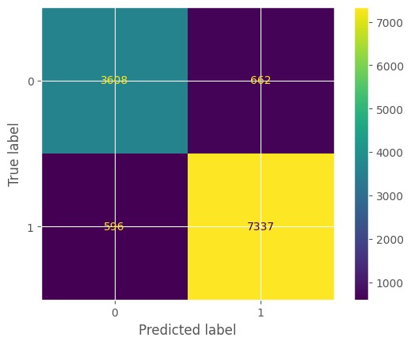

# NLP aplicado para análise de sentimentos de comentários de clientes de um e-commerce brasileiro: Um estudo comparativo de performance de de modelos, entre Árvore de Decisão e Naive Bayes
## *NLP sentiment analysis applied to customers review in a Brazilian e-commerce:  A model  compairson study between Decision Tree and Naive Bayes*
<h2>Introdução</h2>

A voz do cliente é a principal fonte para insights e melhorar a satisfação de clientes e com grandes plataformas de comércio eletrônico, revisar centenas e até milhares de comentários pode ser tornar um desafio. Nesse contexto, ter um modelo de análise de sentimento preciso garante que a informação chegue ao time responsável mais rapidamente e que eles consigam trabalhar para melhorar os processos, impactando na satisfação do consumidor e consequentemente no faturamento

<i>
    <h2>Introduction</h2>
        
The voice of the customer is the source for insights and improving in customer satisfaction and with big e-commerce platforms analyze thousands of customer reviews may become a challenge. Having an accurate sentiment analysis, ensures that data gets to the responsible team much faster and that they can work to improve processes, impacting on customer satiscation and therefore on the revenue.

</i>

<h2>Objetivo do projeto</h2>
<h3>Perspectiva de negócio</h3>

O projeto tem como objetivo responder a três perguntas principais

    <ul>
        <li>Qual é o valor de compra médio?</li>
        <li>Quais são as categorias de produtos mais vendidas?</li>
        <li>É possível criar um modelo de classifacção baseado em NLP para classificar comentários de produtos?</li>
    </ul>
<h3>Perspectiva técnica</h3>
 
 De uma perspectiva técnica o projeto visa:

    <ul>
        <li>Extração e tratamento de dados, entedendo quais informações são relevantes para responder as perguntas do negócio</li>
        <li>Realizar uma análise exploratória dos dados e consolidação dos resultados e explorar os recursos gráficos do seaborn para criação de visualizações mais engajadoras</li>
        <li>Compreender o processo de análise de sentimento com Processamento de Linguagem Natural (PLN)consistindo em:</li>
                <ol>
                    <li>Tratamento do texto e remoção de stopwords(remoção de palavras sem valor semântico) com uso de NLTK e Spacy</li>
                    <li>Transformação de palavras em vetores comparando a eficiência de duas técnicas distintas <i>Bag-of-words</i> e </i>Term Frequency- Inverse Document Frequency (TF-IDF)</i></li>
                    <li>Uso do scikit-learn  para testar  dois modelos de análise de sentimento (Naive-Bayes e Árvore de Decisão)</li>
                    <li>Interpretar e comparar a acurácia dos modelos usando recursos do scikit learn e visualização da matriz de confusão</li>
                </ol>
        <li>Avaliar a viabilidade do modelo testado e em caso positivo, embasar a escolha de um dos modelos</li>
    </ul>

<i>
    <h2>Project objective</h2>
    <h3>Business perspective</h3>
    
This project aims to answer three main questions

        <ul>
            <li>What's the average order value?</li>
            <li>What are the best-selling product categories?</li>
            <li>Is it possible to create a NLP based classification model able to classify a review into good or bad (sentiment analysis)?</li>
        </ul>
    <h3>Technical perspective</h3>
        
From a technical perspective, the project aims to:

        <ul>
        <li>Data extraction and treatment, understanding which datapoints are relevant to answer business questions</li>
        <li> Perform an EDA, consolidating results in charts and exploring seaborn resources to create engaging charts (improve data visualization skills) </li>
        <li>Understand and apply sentiment analysis with Natural Language Processing (NLP) process which consists in:</li>
                <ol>
                    <li>Text cleaning and stopwords removal(remove words that do not contain any semantical value for the NLP model semântico) byusing NLTK and Spacy</li>
                    <li>Feature extraction comparing the efficieny between two techniques  <i>Bag-of-words</i> and </i>Term Frequency- Inverse Document Frequency (TF-IDF)</i></li>
                    <li>Use scikit-learn to evaluate three NLP tecniques (Logistic Regression, Naive-Bayes and Decision Tree)</li>
                    <li>Analyze and compare the accuracy of the models with features from sckit-learn and confusion matrix interpretation</li>
                </ol>
        <li>Evaluate model viablity and if positive, justify the choice of the model</li>
    </ul>

</i>
<h2>Fonte dos dados</h2>

O dataset usado para esse projeto encontra-se disponível em https://www.kaggle.com/datasets/olistbr/brazilian-ecommerce. 
<i>
    <h2>Data source</h2>
    
The dataset used for this project is available at https://www.kaggle.com/datasets/olistbr/brazilian-ecommerce.

</i>
<h2>Metodologia</h2>
    
Para análises relacionadas ao valor médio do pedido e aos produtos mais vendidos, verificou-se se os IDs dos pedidos de compra eram únicos para não contar a mesma compra duas vezes. Todas as informações de pagamento estavam completas. Para a parte de PLN do projeto, as avaliações com menos de 3 dígitos ou vazias foram descartadas, pois não têm valor semântico. Além disso, palavras com até 10 caracteres (usadas para expressar sentimentos como bom, satisfeito, etc.) foram analisadas e um dicionário em Python foi criado para corrigi-las em todas as avaliações. Apenas avaliações com classificação e preenchimento adequados foram usadas no modelo. Como a satisfação média do cliente é 3.6 e o cliente só pode dar notas de 1, 2, 3, 4 ou 5, as classificações 4 e 5 foram consideradas positivas, enquanto o restante foi considerado negativo.

    
O método de NLP proposto foi baseado no trabalhos de Krishna (2018) e Akuma (2022). Ambos os autores utilizam mais de um método de vetorização e algoritmo de classificação para encontrar um modelo com melhor precisão. Para este estudo, o texto foi pré-processado removendo pontuação, stopwords (como artigos e preposições) e vetorizado empregando duas técnicas diferentes: Bag of Words (as palavras são representadas com base em sua multiplicidade, desconsiderando gramática e ordem das palavras) e Term Frequency-Inverse Document Frequency (TF-IDF), que indica se uma palavra é comum ou rara em todas as avaliações. O conjunto de dados foi dividido em conjuntos de teste e treinamento e três algoritmos de classificação foram utilizados, Regressão Logística, Naïve Bayes e Árvore de Decisão, totalizando 6 testes. O melhor método foi escolhido com base na precisão e análise da matriz de confusão
    

    <h2>Methodology</h2>
    
For analysis related to average order value and best selling products it was checked if purchase orders id were unique to not count the same purchase twice. All payment information was complete. For the NLP part of the project reviews with less than 3 digits or empty were discarded as they have no semantic value. In addition to this, words until 10 characters (charactes used to express sentiments such as good, satisfied and so on) were analysed and a P
    ython dictionary was created to correct them in all reviews. Only reviews with rating and properly filled were used on the model. As the average satisfaction of the customer is 3.6, and the customer can only score in 1,2,3,4 or 5, ratings 4 and 5 were considered positive, while the rest negative.
    

    
The proposed NLP method was based on Krishna (2018) Akuma (2022) work. Both authors use more than one vectorizing method and classification algorithm to find a model with better accuracy. For this study, text was preprocessed by removing punctuation, stopwords (such as articles and preposition) and vectorized employing two different techniques Bag of Words (words are represented based on their multiplicty disregarding grammar and word order) and Term Frequency-Inverse Document Frequency (TF-IDF) which indicates if a word is common or rare across all reviews. The dataset was split into test and training sets and three classification algorithms were used,Logistic Regression, Naïve Bayes and Decision Tree, totalizing 6 tests, the best method was chosen based on accuracy and confusion matrix analysis.
    

</i>
<h2>Resultados</h2>
<i><h2>Results</h2></i>
    
Antes de partir para a análise e comparação dos modelos de NLP, é necessário ter conhecimento  dos produtos comercializados, e qual o ticket médio da compra, tais informações auxiliarão no entendimento dos itens presentes nas avaliações. A primeira análise feita tinha como objetivo entender qual é o valor de compra médio, já respondendo a primeira pergunta presente nos objetivos do projeto

<i>   
    
Before diving into the analysis and comparison of NLP models, it's necessary to have knowledge of the products being sold and the average purchase ticket. Such information will aid in understanding the items present in the evaluations. The first analysis conducted aimed to understand what the average purchase value is, thus addressing the first question outlined in the project objectives.

</i>
    

    
O gráfico mostra que praticamente todas as compras se concentram na faixa de 1  a 500 dólares. O valor médio de uma compra é de U$ 47, aproximadamente, enquanto a mediana dos valores das ordens de compra é de U$ 31.

<i>   
    
The chart shows that practicallty all purchases are concentrated in the range of $1 to $500. The average order value is approximately $47, while the median of the purchase order values is $31.

</i>

Em relação à segunda pergunta, as categorias de produtos foram agrupadas em duas abordagens distintas, porém complementar uma a outra. Primeiramente, as categorias de produtos foram agrupads por faturamento, em seguida, foram agrupadas por unidade vendida, conforme mostrados nos gráficos abaixo:

<i>   
    

In relation to the second question, the product categories were grouped into two distinct yet complementary approaches. Firstly, the product categories were grouped by revenue, and then they were grouped by units sold, as shown in the graphs below:

</i>

Este primeiro conjunto de dados permitiu uma melhor compreensão do comportamento do cliente, especialmente nos indicadores-chave de desempenho para comércio eletrônico, como o valor médio do pedido, que foi de $47. A análise das 10 principais categorias de produtos indicou que as categorias mais vendidas são as mesmas quando classificadas pela receita ou pela quantidade de unidades vendidas. No entanto, a ordem de classificação é diferente em cada lista.

<i>   
 
 This first set of data allowed a better understanding of customer behaviour, specially in key performance indicators for e-commerce such as average order value which was $47, the top-10 product category analysis indicated that best selling categories are the same when ranking the list by revenue or amount of sold units. However, the ranking order is different in each list
 
</i>

Em relação às notas das compras, analisou-se a distribuição das notas das avaliações dos clientes  sendo possível observar uma maior concentração de avaliações 4 e 5, com uma nota média de 3.6

</i>
    
In relation to purchase scoring, the distribution of customer review scores was analyzed, with a higher concentration of ratings 4 and 5 being observed, resulting in an average score of 3.6.

</i>

Uma vez finalizada essa análise as revisões foram classificadas em 2 grupos realizar a análise de sentimento. Compras com nota acima da média (4 e 5) foram classificadas como uma experiência positiva, já aquelas compras com nota inferior à média foram classificadas como uma experiência negativa. Essa nova distribuição encontra-se representada graficamente na imagem abaixo.

</i>
    

Once this analysis was completed, the reviews were classified into 2 groups to perform sentiment analysis. Purchases with a rating above average (4 and 5) were classified as a positive experience, while those with a rating below average were classified as a negative experience. This new distribution is graphically represented in the image below.

</i>

Para a escolha do melhor modelo de análise de sentimento foram testados 2 formas de vetorização de palavras (bag-of-words e TF-IDF) três algoritmos de classificação diferentes (regressão logística, Naive Bayes Multinomial e árvore de decisão). Dentre os 6 testes realizados, aquele que apresentou o melhor resultado foi o uso do TF-IDF combinado com a regressão logística, com uma melhor acurácia (0.8969105957551422), AUROC (0.8849178320424185) e F1-Scor (0.8967226677120955), esse resultado também é graficamente representado pela matriz de confusão (com maiores positivos e negativos verdadeiros de todos) diagonal principal com os maiores valores, indicando que há um modelo de análise de sentimento capaz de classificar os comentários dessa plataforma, respondendo a última pergunta 

</i>
    

In order to choose the best sentiment analysis model, two vectorization methods (bag-of-words and TF-IDF) and three different classification algorithms (logistic regression, Multinomial Naive Bayes, and decision tree) were tested. Among the six tests conducted, the one that yielded the best result was the use of TF-IDF combined with logistic regression, with higher accuracy (0.8969105957551422), AUROC (0.8849178320424185), and F1-Score (0.8967226677120955). This result is also graphically represented by the confusion matrix, (with the highest number of true positives and true negatives along the main diagonal), indicating that there is a sentiment analysis model capable of classifying comments on this platform, thus addressing the last question of the project

</i>

<h2>Conclusão</h2>
    
De maneira geral, a Regressão Logística teve uma acurácia melhor do que a Naive Bayes e a Árvore de Decisão. Tanto o bag of words quanto o TF-IDF apresentaram resultados semelhantes, no entanto, de acordo com Akuma (2022), o TF-IDF é recomendado quando a contagem de ocorrência de palavras em um documento (comentário, neste caso) é de suma importância, como acontece ao ler avaliações de clientes.
 

<i>
    <h2>Conclusion</h2>
    
 On the whole, Logistic Regression had a better accurancy than Naive BAyes and Decision Tree. Both bag of words and TFIDF showed similar results, however according to Akuma (2022) TFIDF is recommendend when count of occurence of words in a document (review in this case) of paramount importance as it happens when reading customer reviews

</i>

<h2>Referências</h2>
    

    AKUMA, S.; LUBEM, T.; ADOM, I.; “Comparing Bag of Words and TF-IDF with different models for hate speech detection from live tweets”, 2022. (PDF) Comparing Bag of Words and TF-IDF with different models for hate speech detection from live tweets (researchgate.net) https://www.researchgate.net/publication/363759715_Comparing_Bag_of_Words_and_TF-IDF_with_different_models_for_hate_speech_detection_from_live_tweets
    

    

    KRISHA, A.;AICH, A.; V, A.; HEGDE, C. “Analysis of Customer Opinion Using Machine Learning and NLP Techniques”, 2018. Analysis of Customer Opinion Using Machine Learning and NLP Techniques by Akshay Krishna, Animikh Aich, Akhilesh V, Chetana Hegde :: SSRN https://papers.ssrn.com/sol3/papers.cfm?abstract_id=3315430
    

<i>
    <h2>Reference</h2>
         

            AKUMA, S.; LUBEM, T.; ADOM, I.; “Comparing Bag of Words and TF-IDF with different models for hate speech detection from live tweets”, 2022. (PDF) Comparing Bag of Words and TF-IDF with different models for hate speech detection from live tweets (researchgate.net) https://www.researchgate.net/publication/363759715_Comparing_Bag_of_Words_and_TF-IDF_with_different_models_for_hate_speech_detection_from_live_tweets
        

        

            KRISHA, A.;AICH, A.; V, A.; HEGDE, C. “Analysis of Customer Opinion Using Machine Learning and NLP Techniques”, 2018. Analysis of Customer Opinion Using Machine Learning and NLP Techniques by Akshay Krishna, Animikh Aich, Akhilesh V, Chetana Hegde :: SSRN https://papers.ssrn.com/sol3/papers.cfm?abstract_id=3315430
        

</i>